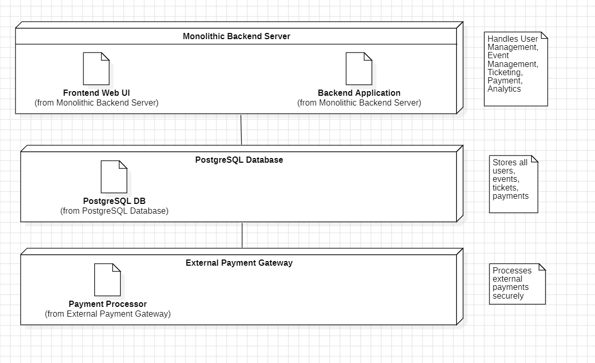
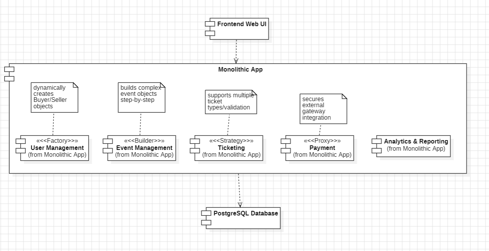
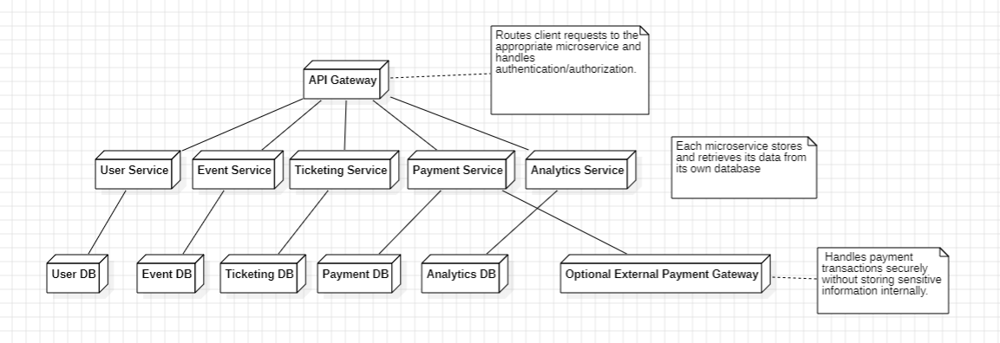
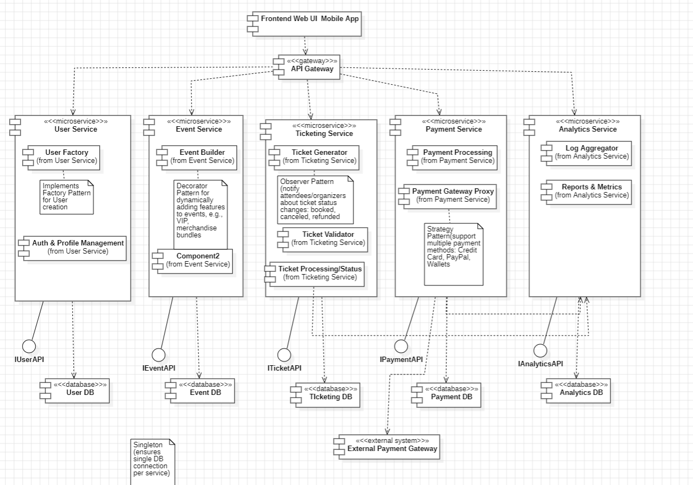
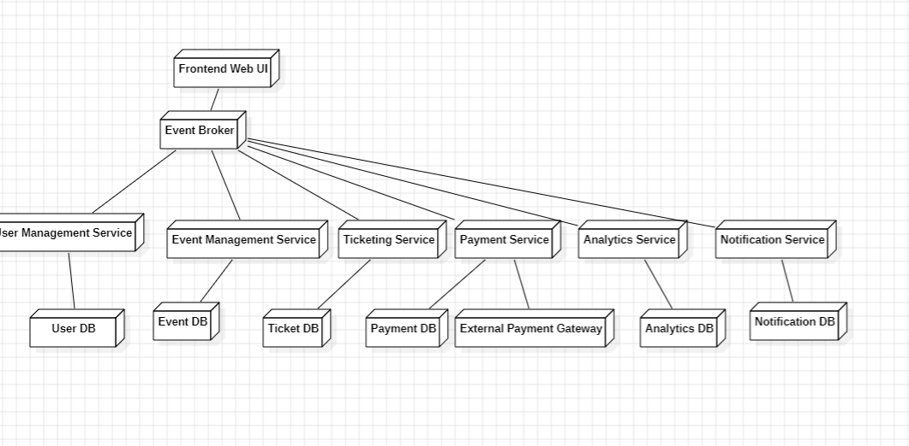
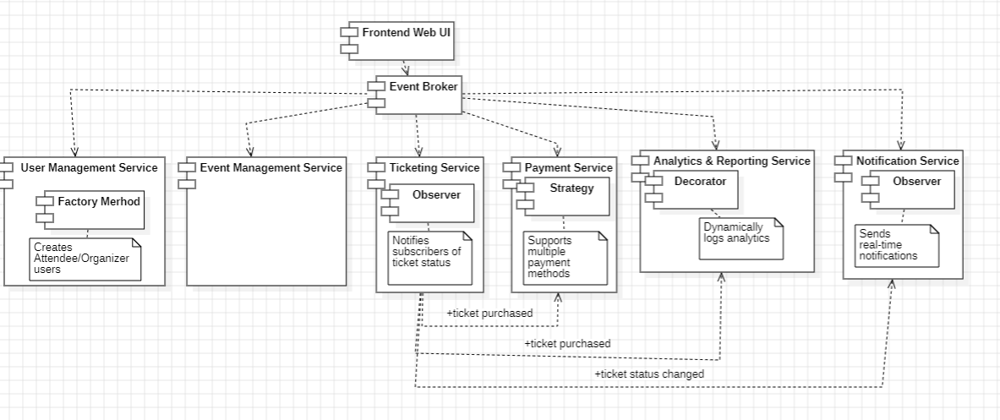

# Milestone 3: Software Architecture Analysis for Event Management & Ticketing System

## Team Members:
- Alexia-Stefania Nica
- Roman Gulida

---

## 1. Monolithic Architecture

### 1.1 Description

The Event Management & Ticketing System is implemented as a single, unified application, where all functionalities are tightly integrated within one codebase and deployed as a single unit. All modules share the same database, and inter-module communication happens internally via method calls.  

This architecture is suitable for a small team, where fast development and strong consistency in transactions (like ticket purchases and payments) are important.

---

### 1.2 Key Components

| Layer | Modules | Patterns / Notes |
|-------|---------|----------------|
| **Presentation Layer** | Web Controllers / Frontend | Handles HTTP requests from users (Attendees / Organizers) and renders responses or views |
| **Business Logic** | - User Management   - Event Management   - Ticketing   - Payment Processing   - Analytics & Reporting | Design patterns used: • User Management: Factory Method for creating Attendee/Organizer • Event Management: Decorator for dynamically adding event features • Ticketing: Observer to notify attendees/organizers about ticket status changes • Payment Processing: Strategy for multiple payment methods • Analytics & Reporting: Observer to asynchronously log events |
| **Data Layer** | PostgreSQL database | Stores all system data: users, events, tickets, payments, analytics, and reviews (Singleton pattern for shared DB connection) |

---

### 1.3 Structure & Data Flow

**System Structure:**
- Single deployable unit: one backend application handles all functionalities.
- Modules inside the monolith:
  - **User Management**: Registration, authentication, roles (Organizer/Attendee)
  - **Event Management**: Create, update, delete, search events
  - **Ticketing**: Issue tickets, generate QR codes, validate tickets
  - **Payment Processing**: Handle payments with multiple gateways
  - **Analytics & Reporting**: Track sales, attendance, and user behavior
  - **Frontend Interface**: Web UI or API layer for clients
- **Database**: One shared relational database storing users, events, tickets, payments, and analytics

**Data Flow Example (Ticket Purchase):**
1. Attendee selects event → request sent to Event Controller  
2. Ticketing module generates ticket and triggers **Observer** notifications  
3. Payment module processes payment using **Strategy** → external gateway  
4. Database updated via **Singleton** connection  
5. Confirmation response sent to Attendee  
6. Analytics module asynchronously logs sale and attendance using **Observer**  

---

### 1.4 Architecture Diagrams

**Deployment Diagram:**  

**Component Diagram:**  

---

### 1.5 Pros and Cons

**Advantages:**
- Simple development: Single codebase  
- Easy testing: End-to-end tests straightforward  
- Strong consistency: ACID transactions across ticket purchases  
- Low operational overhead: One backend + database  
- Fast time to market: Quickly build MVP  

**Disadvantages:**
- Scaling limitations: Must scale entire app even if only one module needs it  
- Technology lock-in: Entire system uses same framework  
- Single point of failure: One bug can crash the app  
- Long-term maintenance: Codebase can become complex as features grow  

---

## 2. Microservices Architecture

### 2.1 Description

The system is decomposed into multiple independent services, each responsible for a specific domain. Services communicate through REST APIs and each manages its own database (or schema).  

This architecture enables independent scaling, parallel development, and high availability.

---

### 2.2 Key Components

| Microservice | Responsibilities | Patterns |
|--------------|-----------------|----------------|
| **User Service** | User registration, authentication, roles | Factory Method |
| **Event Service** | Event creation, update, delete, search | Decorator |
| **Ticketing Service** | Generate tickets, validate QR codes | Observer |
| **Payment Service** | Handle multiple payment methods | Strategy |
| **Analytics Service** | Track sales, attendance | Observer |
| **API Gateway** | Routes requests from frontend to services | - |
| **Frontend Interface** | Web UI / Mobile Client | - |

---

### 2.3 Structure & Data Flow

**System Structure:**
- Each service is an independent deployable unit  
- API Gateway handles routing, authentication, and aggregation  
- Services communicate via REST APIs  
- Each service manages its own database using **Singleton** pattern for DB connection  

**Data Flow Example (Ticket Purchase):**
1. Attendee selects event → request sent to **API Gateway**  
2. **Event Service** validates availability  
3. **Ticketing Service** generates ticket → triggers **Observer**  
4. **Payment Service** processes payment (**Strategy**)  
5. Databases updated independently (**Singleton**)  
6. **Analytics Service** asynchronously logs sale (**Observer**)  
7. Confirmation sent to Attendee via API Gateway  

---

### 2.4 Architecture Diagrams

**Deployment Diagram:**  

**Component Diagram:**  

---

### 2.5 Pros and Cons

**Advantages:**
- Independent scaling for high-demand services  
- Technology flexibility per service  
- Fault isolation: failure in one service does not crash others  
- Parallel development by multiple teams  

**Disadvantages:**
- Increased complexity: monitoring, orchestration needed  
- Inter-service communication overhead  
- Distributed database consistency requires careful handling  

---

## 3. Event-Driven Architecture

### 3.1 Description

The system is structured around events and an event broker. Services communicate asynchronously by publishing and subscribing to events.  

This architecture improves decoupling, scalability, and responsiveness.

---

### 3.2 Key Components

| Component | Responsibilities | Patterns |
|-----------|-----------------|----------------|
| **Event Broker** | Handles events published by services and delivers to subscribers | - |
| **User Service** | Manages users and publishes events on creation/update | Factory Method |
| **Event Service** | Manages events, publishes notifications | Decorator |
| **Ticketing Service** | Issues tickets and publishes status changes | Observer |
| **Payment Service** | Processes payments and emits events | Strategy |
| **Analytics Service** | Subscribes to events to log and analyze | Observer |
| **Frontend Interface** | Web UI or mobile client publishes user actions | - |

---

### 3.3 Structure & Data Flow

**System Structure:**
- Services communicate asynchronously via **Event Broker**  
- Each service manages its own database (**Singleton**)  
- Frontend publishes actions, subscribes to updates via broker  

**Data Flow Example (Ticket Purchase):**
1. Attendee selects event → frontend publishes **TicketRequested** event  
2. **Ticketing Service** generates ticket → publishes **TicketCreated** event (**Observer**)  
3. **Payment Service** processes payment (**Strategy**) → publishes **PaymentCompleted**  
4. **Analytics Service** subscribes to all events to update logs (**Observer**)  
5. Attendee receives confirmation asynchronously  

---

### 3.4 Architecture Diagrams

**Deployment Diagram:**  

**Component Diagram:**  

---

### 3.5 Pros and Cons

**Advantages:**
- High decoupling: services operate independently  
- Highly scalable and resilient  
- Easy to add new services without impacting existing ones  

**Disadvantages:**
- Increased system complexity  
- Debugging is more difficult due to async communication  
- Requires robust event broker infrastructure  

---

## 4. Architecture Comparison

| Feature | Monolithic | Microservices | Event-Driven |
|---------|------------|---------------|--------------|
| Complexity | Low | Medium | High |
| Scalability | Low | High | High |
| Deployment | Simple | Medium | Medium |
| Fault Isolation | Low | High | High |
| Development Speed | High | Medium | Medium |
| Data Consistency | Strong | Distributed | Eventual |
| Team Suitability | Small | Medium/Large | Medium/Large |

**Recommended Architecture:**  
For the Event Management & Ticketing System MVP, **Monolithic Architecture** is most suitable due to its simplicity, strong transactional consistency, low infrastructure cost, and suitability for a small development team. Microservices or Event-Driven architectures are better for scaling later when user demand increases.

